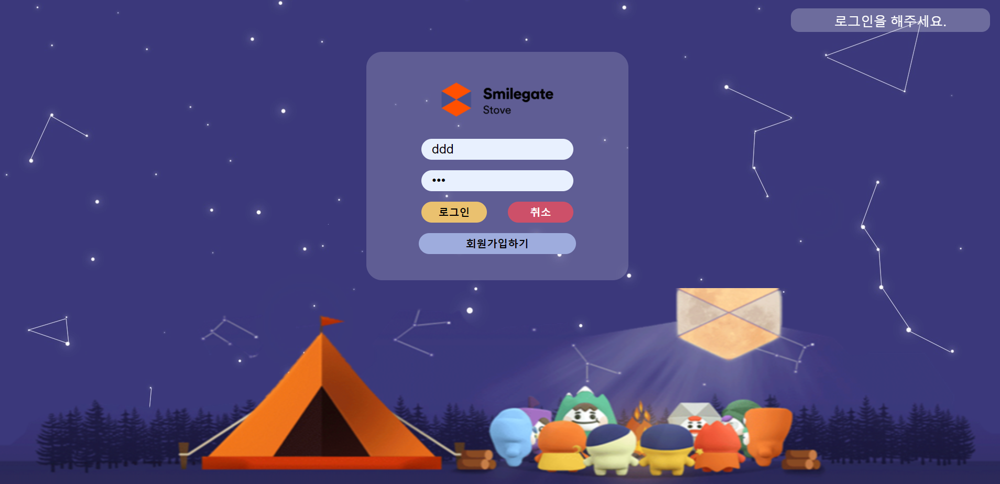
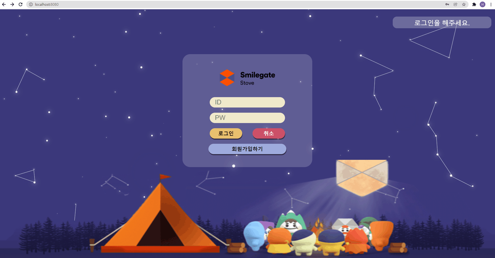
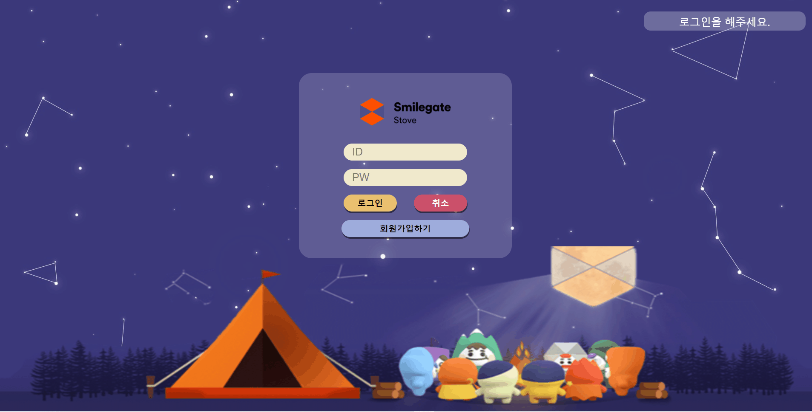
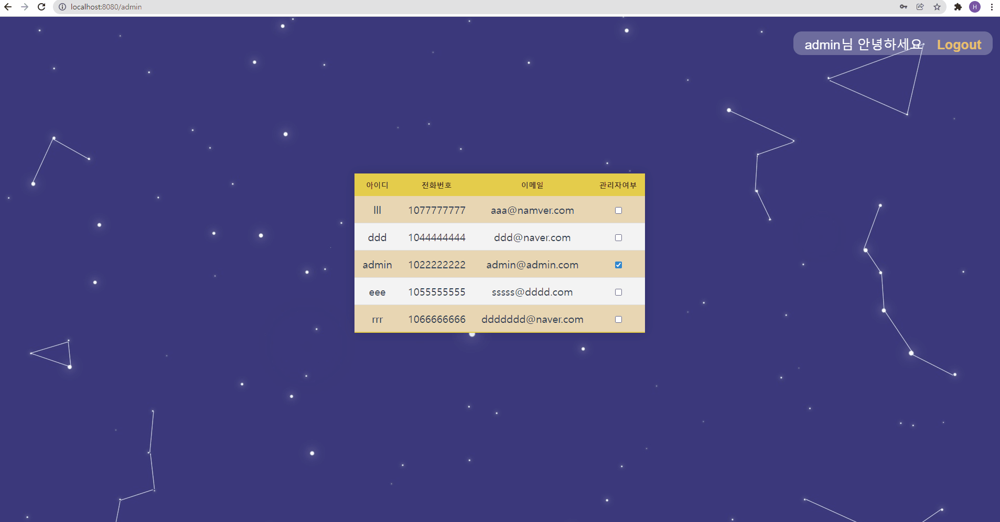
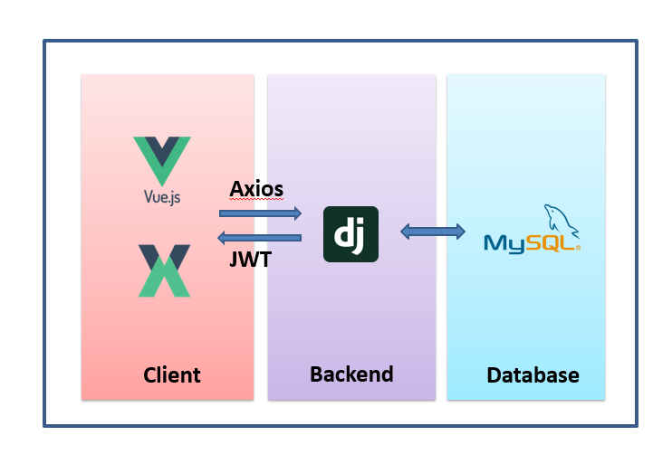

# CocoTalk-Frontend

[프론트엔드 정리](./assets/FrontendNote.md)

### 

## 개요

### 목표

☘ 기본기능 완성을 최우선 목표로한다.

* 백엔드 구현시 프레임워크가 제공하는 기술을 최소한으로 사용해 구현한다.

☘ 버튼 클릭후 페이지 이동을 하거나 데이터가 변경되는 경우 새로고침이 되도록 일어나지 않게 구현하다.

☘ 개발과정 전반과 trouble shooting을 잘 기록해둔다.


### 사용 기술

[백엔드] Django, Django Rest Framework

[프론트엔드] Vue, Vuex

[데이터베이스] MySQL 


### 요구사항 정의

[로그인 페이지]

* 유저 아이디 입력칸, 비밀번호 입력 칸(data binding), 로그인 버튼, 회원가입버튼

* 아이디 또는 비밀번호 틀릴 경우 틀렸다는 알림이 뜨도록한다.(프론트처리)

* 비밀번호 입력시 로 보이지 않게 처리

* 회원가입 버튼 클릭시 가입페이지로 이동.

* 로그인 클릭시 로그인 성공페이지 띄우기

  [로그인 성공페이지] : 스마일게이트 캐릭터들이 통통 뛰고 있기

[회원가입 페이지]

* 유저이름, 유저 아이디 입력창, 비밀번호 입력창, 비밀번호확인창, 회원가입버튼, 취소버튼
* 아이디 조건, 비밀번호 조건 placeholder로 띄워놓기
* 아이디와 비밀번호가 조건에 어긋나면 경고 문구뜨게 만들기
* 회원가입 클릭시 회원가입 성공 문구 뜨고 로그인 페이지로 이동해달라는 문구뜸
* 알림이후 로그인페이지로 이동

[admin 페이지]

* 관리자로 로그인할 경우 해당 페이지로 이동


* 유저 전체정보 가져오기


==아래 사항은 현재 추가중

* 비밀번호는 암호화되어 보이기. 비밀번호 초기화

* 유저 추가

* 유저 삭제

  


[추가사항]

이메일 인증

비밀번호 찾기


## 주요 기능

1. 로그인 기능

- 아이디와 패스워드를 입력해 로그인 할 수 있다.

- 아이디 또는 비밀번호가 틀릴  경우에는 틀렸다는 알림이 뜨도록 한다.

  ### 메인화면

  

  



1. 회원가입 기능
2. 







[로그인 페이지]

- 유저 아이디 입력칸, 비밀번호 입력 칸(data binding), 로그인 버튼, 회원가입버튼

- 아이디 또는 비밀번호 틀릴 경우 틀렸다는 알림이 뜨도록한다.(프론트처리)

- 비밀번호 입력시 로 보이지 않게 처리

- 회원가입 버튼 클릭시 가입페이지로 이동.

- 로그인 클릭시 로그인 성공페이지 띄우기

  [로그인 성공페이지] : 스마일게이트 캐릭터들이 통통 뛰고 있기

[회원가입 페이지]

- 유저이름, 유저 아이디 입력창, 비밀번호 입력창, 비밀번호확인창, 회원가입버튼, 취소버튼
- 아이디 조건, 비밀번호 조건 placeholder로 띄워놓기
- 아이디와 비밀번호가 조건에 어긋나면 경고 문구뜨게 만들기
- 회원가입 클릭시 회원가입 성공 문구 뜨고 로그인 페이지로 이동해달라는 문구뜸
- 알림이후 로그인페이지로 이동

[admin 페이지]

- 관리자로 로그인할 경우 해당 페이지로 이동


- 유저 전체정보 가져오기

==아래 사항은 현재 추가중

- 비밀번호는 암호화되어 보이기. 비밀번호 초기화

- 유저 추가

- 유저 삭제

  

[추가사항]

이메일 인증

비밀번호 찾기


### 아키텍쳐



### User Table

| column    | content                         |
| --------- | ------------------------------- |
| id        | 자동 부여 고유값                |
| username  | 아이디                          |
| password  | 비밀번호 ( 암호화)              |
| phone     | 전화번호                        |
| email     | 이메일                          |
| is_admin  | 관리자 여부                     |
| is_active | 활성화 여부 (탈퇴시 deactivate) |


## 개발 과정 및 Trouble Shooting

### 1. 유저 모델 생성

#### [Backend]

##### 🌷내장 기능 구현법

* Django 에는 기본적으로 제공하는 User모델이 있다. 이를 사용하면 따로 모델링을 해주지 않아도 기본 shema를 바로 생성할 수 있다.

> models.py

```python
from django.db import models
from django.contrib.auth.models import AbstractUser

class User(AbstractUser):
    pass
```

* Django 에서는 [PBKDF2](https://en.wikipedia.org/wiki/PBKDF2) 라는 기본 암호화 시스템을 제공중이다. 현재는 이를 사용해 구현되어있다.

[참고] https://velog.io/@dev_dolxegod/Django-Authentication-System%EC%9D%98-%EB%AA%A8%EB%93%A0-%EA%B2%83-1-authuser-%EA%B8%B0%EB%B3%B8

##### 🌻직접  + 응용 구현

> models.py

* 기본 제공해주는 User model을 바탕으로 해당 속성값을 지정해주고 추가적인 학목을 커스텀해 제작했다.


* 사용자에는 관리자와 관리자가 아닌 일반 사용자라는 2가지 종류가 있으므로 

  일반 유저) `is_admin : 0`, 관리자) `is_admin : 1` 로 지정해주었다.

  유저아이디) 20자 이하로 설정하였다. (환영인사 tempate 칸수를 고려하였다.)

  이메일) 최대 255자 지원이라는 레퍼를 보고 설정하였다.

  **유저 자격의 확장성을 위해 Bool이 아닌 Int 필드로 생성하였다.**

```python
from phonenumber_field.modelfields import PhoneNumberField

class User(AbstractBaseUser):
    id = models.AutoField(primary_key=True)
    username = models.CharField(default='', max_length=20, null=False, blank=False, unique=True)
    email = models.EmailField(default='', max_length=255, null=False, blank=False, unique=True)
    phone = PhoneNumberField(default='', max_length=12, null=False, blank=False, unique=True)
    is_active = models.IntegerField(default=0)    
    is_admin = models.IntegerField(default=0)
    
    # 헬퍼 클래스 사용
    objects = UserManager()

    # 사용자의 username field는 username으로 설정
    USERNAME_FIELD = 'username'
    # 필수로 작성해야하는 field
    REQUIRED_FIELDS = ['password', 'email', 'phone']

    def __str__(self):
        return self.username
```

* 커스텀 모델을 일반유저인지 관리자인지에따라 생성해주는 관리자 모델도 추가 제작하였다.
* 관리자는 시스템에서 부여해주는 형태로 제작해두었다. 

```python
class UserManager(BaseUserManager):
    # 일반 user 생성
    def create_user(self, email, phone, username, password=None):
        if not email
            raise ValueError('no user email')
        if not phone:
            raise ValueError('no user phone')
        if not username:
            raise ValueError('no user username')
        user = self.model(
            email = self.normalize_email(email),
            phone = phone,
            username = username
        )
        user.set_password(password)
        user.save(using=self._db)
        return user

    # 관리자 user 생성
    def create_superuser(self, email, username, phone=None, password=None):
        if phone is None:
            phone = '등록요함'
        user = self.create_user(
            email,
            password = password,
            phone = phone,
            username = username
        )
        user.is_admin = 1
        user.save(using=self._db)
        return user

```


### 2. 로그인 기능

#### [백엔드]

##### 🌷 내장 기능으로 구현법

* Django 에는 obtain_jwt_token 이라는 jwt를 자동 생성해서 보내주는 기능이 있다.

> accounts > urls.py

```python
from rest_framework_jwt.views import obtain_jwt_token
from django.urls import path
from . import views

path('api-token-auth/', obtain_jwt_token),

```

##### 🌻 직접 구현

* 내장 기능 구현 대신 직접 jwt 를 생성하고 원하는 정보를 보내줄 수 있도록 만들어보았다.

> accounts > urls.py

```python
from django.urls import path
from . import views

urlpatterns = [
    path('login/', views.login),
]

```


> views.py

* ""에러메세지 세분화 생각해보기!

```python
from django.http.response import JsonResponse
from json import JSONEncoder

@api_view(['POST'])
def login(request):
    username = request.data.get('username')
    password = request.data.get('password')
    user = get_object_or_404(get_user_model(), username=username)
    context = {
        'response': 'success',
        'message': 'sucess login',
        'user': user,
        'token': jwt_create(username)
    }
    return JsonResponse(EmployeeEncoder().encode(context), safe=False)

def jwt_create(username):
    now = datetime.now()
    key = settings.SECRET_KEY
    now_time = str(now.year)+str(now.month)+str(now.day) + \
        str(now.hour)+str(now.minute)+str(now.second)
    payload = {
        "username": username,
        "now_time": now_time
    }
    jwt_token = jwt.encode(payload, key, algorithm='HS256').decode('utf-8')
    return jwt_token

# subclass JSONEncoder
class EmployeeEncoder(JSONEncoder):
    def default(self, o):
        return o.__dict__
```


> views.py

```python
from rest_framework import status
from rest_framework.decorators import api_view
from rest_framework.response import Response
from .serializers import UserSerializer


@api_view(['POST'])
def signup(request):
	#1-1. Client에서 온 데이터를 받아서
    password = request.data.get('password')
    password_confirmation = request.data.get('passwordConfirmation')
		
	#1-2. 패스워드 일치 여부 체크
    if password != password_confirmation:
        return Response({'error': '비밀번호가 일치하지 않습니다.'}, status=status.HTTP_400_BAD_REQUEST)
		
	#2. UserSerializer를 통해 데이터 직렬화
    serializer = UserSerializer(data=request.data)
    
	#3. validation 작업 진행 -> password도 같이 직렬화 진행
    if serializer.is_valid(raise_exception=True):
        user = serializer.save()
        #4. 비밀번호 해싱 후 
        user.set_password(request.data.get('password'))
        user.save()
        # password는 직렬화 과정에는 포함 되지만 → 표현(response)할 때는 나타나지 않는다.
        return Response(serializer.data, status=status.HTTP_201_CREATED)
```

**[질문사항]**

- 비밀번호입력값과 비밀번호확인입력값이 같음을 확인하는 경우 프론트와 백 둘다 처리해주는 것이 맞는지, 프론트에서만 처리해주는 것이 맞는지?

  [프론트에서 처리]

  ```javascript
  // 비밀번호입력값 == 비밀번호확인값
        if (this.credentials.password == this.credentials.passwordConfirmation){
          axios({
            method: 'post',
            url: 'http://127.0.0.1:8000/accounts/signup/',
            data: this.credentials,
          })
            .then(res => {
              console.log(res)
              // this.$router.push({ name: 'Login' })
            })
            .catch(err => {
              console.log(err)
            })
        }else{
          alert('입력하신 비밀번호와 비밀번호 확인값이 다릅니다.')
        }// 비밀번호입력값 == 비밀번호확인값
        if (this.credentials.password == this.credentials.passwordConfirmation){
          axios({
            method: 'post',
            url: 'http://127.0.0.1:8000/accounts/signup/',
            data: this.credentials,
          })
            .then(res => {
              console.log(res)
              // this.$router.push({ name: 'Login' })
            })
            .catch(err => {
              console.log(err)
            })
        }else{
          alert('입력하신 비밀번호와 비밀번호 확인값이 다릅니다.')
        }
  ```

  [백엔드에서 처리]

  ```python
  #1-1. Client에서 온 데이터를 받아서
  password = request.data.get('password')
  password_confirmation = request.data.get('passwordConfirmation')
  
  #1-2. 패스워드 일치 여부 체크
  if password != password_confirmation:
      return Response({'error': '비밀번호가 일치하지 않습니다.'}, status=status.HTTP_400_BAD_REQUEST)
  		
  ```

> models.py

> serializers.py

```python
from django.db.models import fields
from rest_framework import serializers
from django.contrib.auth import get_user_model

User = get_user_model()

class UserSerializer(serializers.ModelSerializer):
    # write_only : 시리얼라이징은 하지만 응답에는 포함시키지 않음
    password = serializers.CharField(write_only=True)

    class Meta:
        model = User
        fields = ('username', 'password')
```


https://wisdom-990629.tistory.com/44

https://wikidocs.net/10308

https://hckcksrl.medium.com/django-%EC%BB%A4%EC%8A%A4%ED%85%80-%EC%9C%A0%EC%A0%80-%EB%AA%A8%EB%8D%B8-custom-user-model-b8487c0d150


list error

https://spoonhasi.tistory.com/2

[참고] https://github.com/SSAFY-5th-seungwoon/Moya_backend


[참고]https://dora-guide.com/mysql-insert-update-delete/

