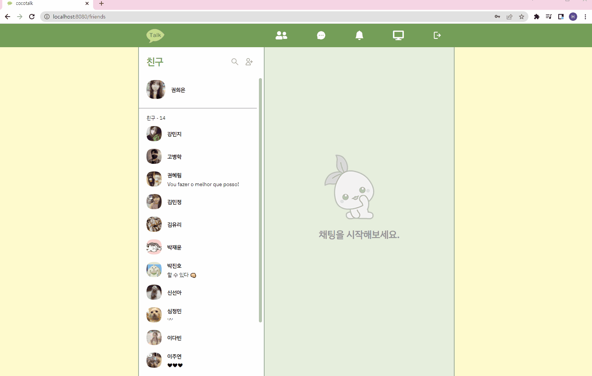
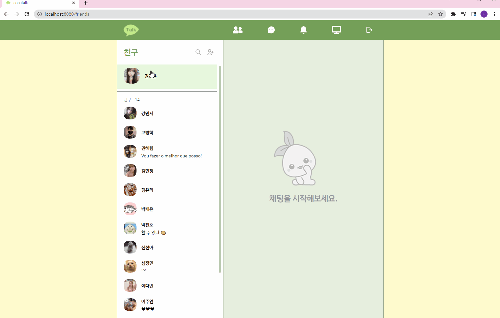
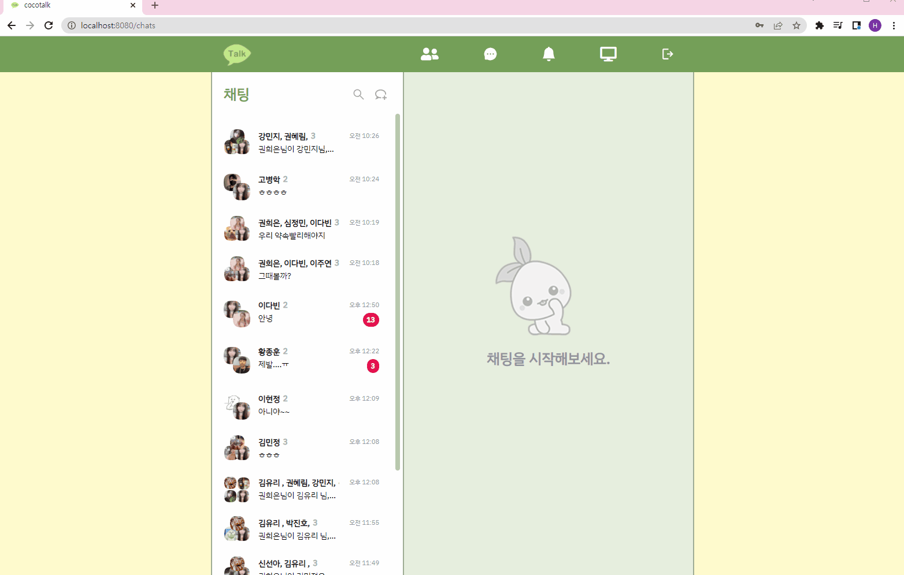
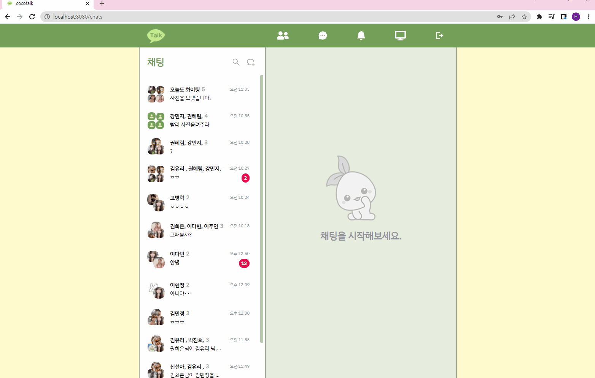
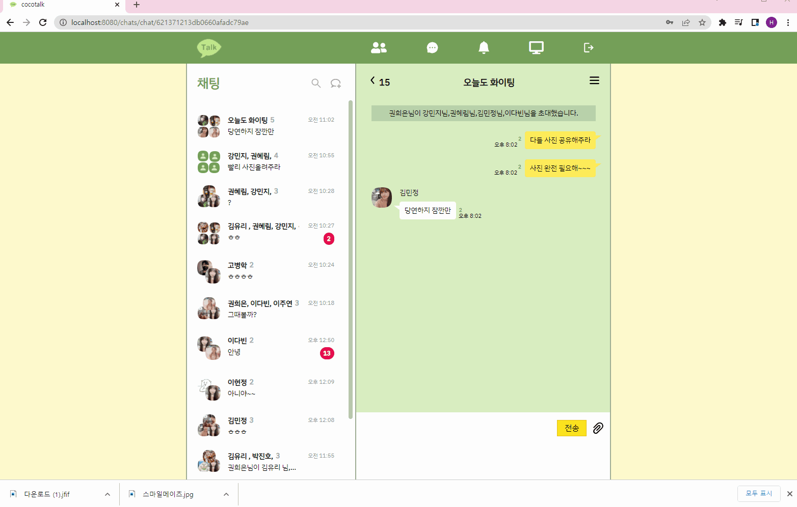
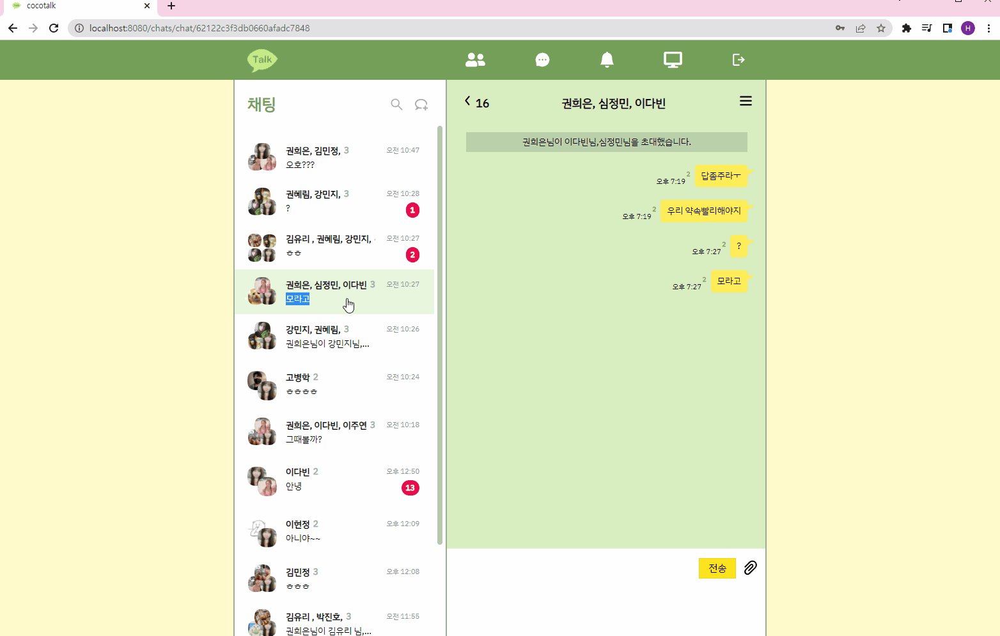
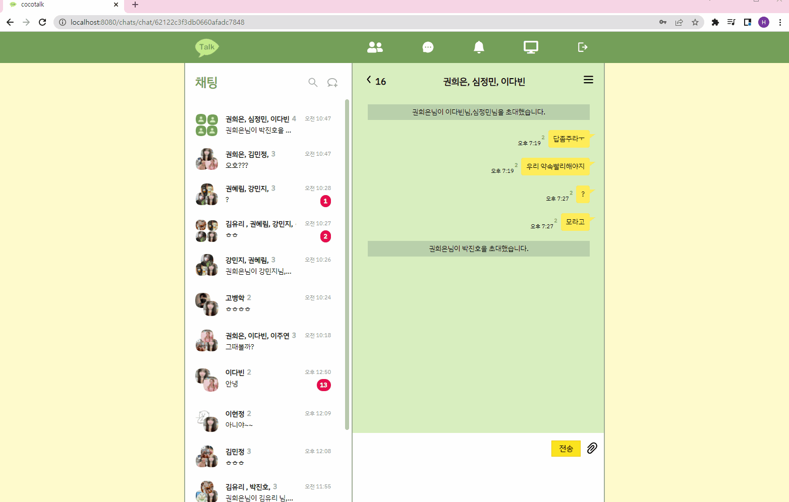
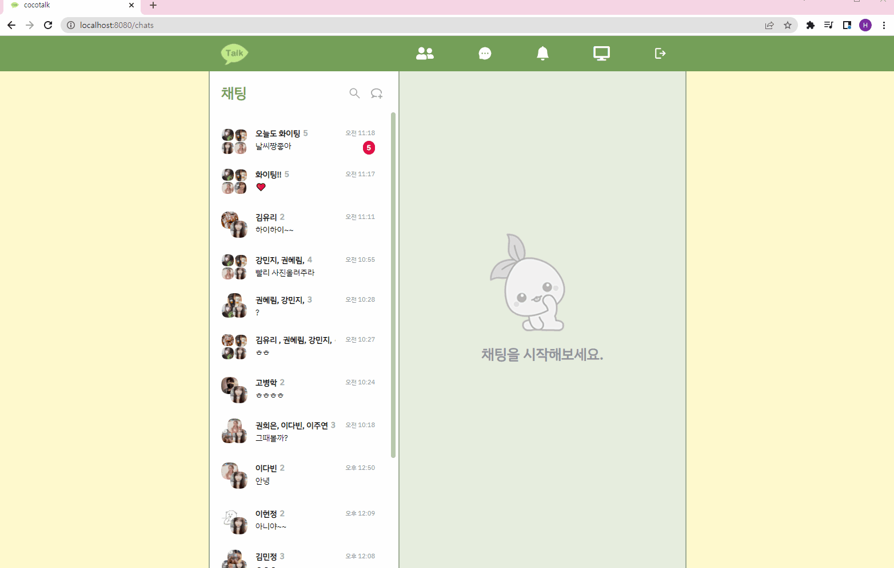
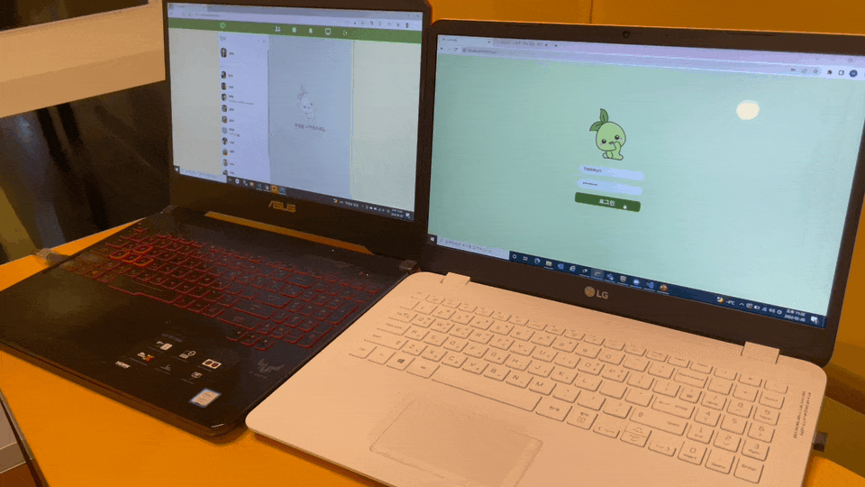

# CocoTalk-Frontend

------

## ⚙ 개요

본 프로젝트는 Stove Dev Canp 2기 Oasis팀의 카카오톡 클론 프로젝트입니다.

카카오톡의 웹버전이 있다면 어떤 모습일지 고민하며 설계하고 개발했습니다.

스마일게이트의 인기 캐릭터 모코코 컨셉의 디자인으로 UI를 구현했습니다.


### 🎇목표

☘ 여러 웹메신저를 분석해 장점만을 차용하여 사용성 높은 형태의 UI를 설계하고 프로토타입을 제작한다.

☘ 아키텍처와 백엔드 로직 설계에 참여해 서비스 흐름을 이해하고 함께 기능구현 로직을 고민한다.

☘  데이터 통신 시나리오를 작성하고 렌더링 로직을 설계한다.

☘ Vue의 렌더링 로직을 이해하고 지속적인 검토를 통해  사용성을 개선한다.

☘ 개발과정 전반과 trouble shooting을 잘 기록해둔다.


### 🛠사용 기술

* Vue
* Vuex


### 🔧아키텍쳐


### ✨프로토타입

> Figma로 제작한 프로토타입 링크입니다.

https://www.figma.com/file/JfWarDBL2JrtpRMAZv1lhJ/Untitled?node-id=0%3A1


------

## ✔프로젝트 실행방법

#### npm 설치

```
npm install
```

#### 프로젝트 실행

* cocotalk 폴더로 이동해 명령어를 실행해주세요.

```
npm run serve
```

#### 로그인

> 회원가입은 모바일에서만 진행합니다. 로그인을 원하시면 아래 정보를 사용해주세요.

[아이디] heeeun

[비밀번호] 12345678


------

## 🏷 페이지별 주요 기능

### [로그인 페이지]

* 로그인 기능
* 네비게이션 가드


### [친구목록 페이지]

* 친구목록 조회
* 친구이름으로 검색
* 친구 추가
* 친구 프로필 열람
* 내 프로필 열람
* 내 프로필 편집
* 개인 채팅 시작
* 개인 채팅방 생성



* 프로필 편집




### [채팅방 목록 페이지]

* 채팅방 목록 조회
* 채팅방 이름으로 검색
* 신규메세지 수령에 따른 채팅방 목록 실시간 업데이트
* 채팅방별 읽지 않은 메세지수 확인
<<<<<<< HEAD
=======
* 단체 채팅방 생성
>>>>>>> b183c4e6c704ff8d7199890ad9148f4ec32a2385



* 채팅방 생성




<<<<<<< HEAD

=======
>>>>>>> b183c4e6c704ff8d7199890ad9148f4ec32a2385
### [채팅 페이지]

* 1:1 채팅
* 단체 채팅
<<<<<<< HEAD
* 친구추가
* 이미지 전송
* 채팅방 서랍 - 이미지 모아보기
=======
* 단체 채팅방에서 친구 초대
* 개인 채팅방에서 친구 초대시 단체 채팅방 생성
* 채팅방 나가기
* 채팅방 서랍 이미지 전체 확인
* 이미지, 동영상, 파일 전송
>>>>>>> b183c4e6c704ff8d7199890ad9148f4ec32a2385



* 채팅방 내부에서 초대



* 채팅방 나가기



* 채팅방 내역 무한스크롤로 불러오기



### [개발자 페이지]

> 본래 설정을 넣으려 했으나 채팅에 주력하여 개발진 소개 페이지로 전환했습니다.

* 프로젝트를 함께 진행한 오아시스팀 소개


### [에러 페이지]

* 올바르지 않은 경로로 진입시 해당 페이지로 이동


------

## 💡 개발 과정 및 Trouble Shooting


## 1. Router

메신저의 편의성을 위해 전체화면에서 네브바를 제외하면 크게 두 부분으로 나누어지도록 구성하였다.
"친구목록/채팅방목록 & 선택한 채팅방(해당 위치는 설정과같은 정보도 나오도록 사용)"

=> 이 때, 채팅방이 열려져있는 상태라면 친구목록으로 이동하였을 때도 해당 방이 유지되어야한다. 새로 rendering될 경우 현재 보고 있는 화면과도 달라지고 불필요한 rendering이 추가 된다.

* 화면의 큰 두 부분의 url이 사용성있게 변화해야한다.

  ```javascript
  "/friends" : 친구목록 / 채팅시작 전 화면
  "/chats" : 채팅방목록 / 채팅시작 전 화면
  "/friends/chat/{chatId}" : 친구목록 / 특정 채팅화면 
  "/chats/chat/{chatId}" : 채팅방목록 / 특정 채팅화면 
  ```

* 화면의 큰 두 부분이 각각 독립적으로 rendering되어야한다.


### Named Route

> 특정 페이지로 이동했을 때 다수의 컴포넌트가 독립적으로 같은 위치에 동시에 표현되는 방법이다.
>

* 화면이 크게 두 부분으로 나뉘어지기 때문에 각 부분을 left와 right로 구분했다.

> App.js

```javascript
<router-view name="left" />
<router-view name="right" />
```

* url은 크게 6가지로 나뉘어진다.
  친구목록 + 채팅방 시작전 / 친구목록 + 채팅방열림 / 친구목록 + 설정열림
  채팅방목록 + 채팅방 시작전/ 채팅방목록 + 채팅방열림 / 채팅방목록 + 설정열림
  따라서 각 url변화에 따라 화면의 해당구역에 들어갈 component를 지정했다.

✨root와 params가 아니라 해당 url의 구역에 맞는 component를 지정해서인지 url이 바뀌어도 component가 동일하다면 rendering이 이루어지지 않는다! 
=> 열린 채팅방을 유지할 수 있다는 장점!

​                                                                                                                                                                                                                                                                                 

## 2. Vuex를 이용한 상태관리

### Modal 상태관리

> [도입하게 된 이유]
> 현재 이중 분할 화면 template을 구현 중인데, 이 경우 최하위 컴포넌트에서 클릭했을 때 전체화면에 꽉차는 형태의 모달을 구현하고 싶다. 그렇다면 Modal은 최상위 분할 이전 컴포넌트에 있어야하는데, 클릭 이벤트 emit이 계속해서 발생하는 것은 비효율적이다. 따라서 Modal의 상태를 전역에서 관리해주는 것이 좋지 않을까 하는 생각을 하게 되었다. 


### 웹소켓과 통신

> 모든 component에서 사용하는 데이터 그리고 사용자의 플로우를 위해 필요한 플래그 데이터 등을 모두 vuex에서 관리한다. 특히 동시로그인과 같이 사용자가 서비스를 사용하고 있는 동안 유지되는 소켓통신이 필요했고 이를 모든 component에서 활용할 수 있는 vuex에서 진행한다.

[vuex 통신]

* 서비스를 사용하는 동안 연결이 유지되는 전역소켓 : pub / sub / connection 을 모두 진행
* 친구목록, 유저정보, 채팅방목록 관련 통신 => 상태도 저장

[component 내부 통신]

> 채팅방 내부에서 사용하는 데이터는 다른 component에서 사용하지 않으므로 채팅방 component 에서만 내부 통신이 이루어진다.

* 채팅방에 입장하는 경우 connect, 퇴장하는 경우 disconnect 된다.
* 채팅방 메세지 내역은 저장하지 않는다.


## 3. 다중 로그인 관리

>  웹기기 1대, 모바일 기기 1대만 동시 로그인이 가능하도록 설정하였다.

* 서비스가 진행되는 동안 항상 connection을 유지하는 소켓으로 다른 기기에 로그인이 되었다는 정보를 받으면 로그아웃 되도록 설정한다. 
* 잠자기 상태였거나 PC가 통신이 이루어지지 않았던 경우 서비스 이용을 위한 요청을 보낼때 fcm Token을 보내 가장 최근 로그인한 기기가 맞는지 비교하고 다른 경우에는 로그아웃 되도록 설정한다.





## 4. 채팅방 목록의 실시간 변화

 #### < template 구현 >

* 채팅방 목록은 최신 메세지가 온 채팅방이 최상단으로 이동하기 때문에 지속적인 변화가 발생한다. 이를 보다 사용자가 편안하게 느낄 수 있도록 `transition-group`을 활용해 삭제와 추가에 애니메이션을 구현하였다.

#### < script 구현 >

1. 채팅방목록을 갱신해줄 마지막 메세지 정보를 받는다.

2. **마지막 메세지가 들어오면 채팅방 목록에서 해당 방을 찾아 모든 정보를 갱신해준다. 이때, 현재 접속중인 채팅방이 아니라면(앞서 설명한 vuex에 저장된 roomㄴtatus활용)" 안 읽은 메세지수를 +1 해준다.** 채팅방목록의 최상단에 있다면 정보만 갱신해주지만 다른 위치에 있다면 최상단으로 위치를 변화시키기위해 목록에서 삭제후 최상단위치로 이동시켜준다.

3. **번들은 효과적으로 서버에 메세지를 저장하기 위해 고안한 방법이다. 먼저, 메세지를 300개 단위로 번들에 저장하고 저장된 번들의 ID와 몇번째 메시지인지를채팅방정보에서 갱신한다. 메세지가 저장된 위치를 파악할 수 있기때문에 이후 채팅방에 입장하여 스크롤업을 통해 일정 개수의 메세지를 가져오기에도 용이하다.**

### <채팅방목록 형태에 대한 고민>

* 채팅방목록의 갱신이 빈번하니 추가 삭제에 용이한 Map을 사용하려했으나 Vue가 Map자료형의 변화를 감지하는 것에 많은 이슈가 있었다. `$set`과 `$delete`라는 해결 방법을 찾았으나 적용이 잘 되지 않았고 `splice, unshift`등의 변화감지에 용이한 Array를 사용하였다.


<<<<<<< HEAD
## 5. 채팅방 내부 페이징

> 채팅방 내부에서 이전 채팅 히스토리를 불러오기 위한 무한 스크롤을 구현하였다.

* 처음부터 모든 채팅 내역을 불러오는 것이아니라 일정 단위의 개수로 불러오기 때문에 빠르게 렌더링이 가능하다. 
* 채팅방 최상단에 스크롤이 위치하면 이전 채팅내역을 불러오며 스크롤은 기존위치에 멈춰있도록 구현해 사용자가 자연스럽게 이용할 수 있도록 구현하였다.


## 6. Template & CSS
=======

## 5. Template & CSS
>>>>>>> b183c4e6c704ff8d7199890ad9148f4ec32a2385

### 스쿼클 구현(SVG)

> 카카오톡 프로필모양의 스쿼클을 구현하기위해 사용하였는데, figma의 iconify를 사용할때에도 code는 span이지만 브라우저상에서 svg로 아이콘이 그려지는 것을 확인하였다. 해당 아이콘 부분에서 모달을 띄울때 미세한 깜빡임이 발생하는 것을 파악해 이를 해결하고자 fontawesome으로 대체하였다. 그러니 깜빡임은 일어나지 않았다. 

[참고] https://velog.io/@roghabo/Squircle-%EC%8A%A4%EC%BF%BC%ED%81%B4


------

## ⛳향후 도전 과제

1. 오프라인에서도 이용내역을 확인하는 서비스를 진행시 IndexedDB를 사용
2. 현재 패드와 PC환경에서의 반응형만을 구현함 => 모바일웹환경을 위한 반응형 제작
3. 보다 높은 사용성을 위한 애니메이션 활용
4. 이미지 전송과 렌더링을 효과적으로 할 수 있는 방안 고안


------

## ✨ 소감

 카카오톡의 사용 경험을 토대로 같은 서비스 사용 플로우를 가지고 가려고 노력했다. 개인카톡방에서는 서로 나간 것을 알 수 없거나 개인 톡방에서 친구 초대시 새로운 단체 톡방이 생성되는 것과 같은 사용성을 그대로 구현하였다. 이 과정에서 카카오톡 개발자가 생각해 나간 흐름을 따라가는 경험을 한 것 같다. 팀원들과 모든 기능을 어떤 식으로 구현하는 것이 맞을지 고민하고 설계하면서 배운점이 많았다. 백엔드로부터 데이터를 받아 사용하기만 하는 것이 아니라 백엔드가 데이터베이스에 접근해 정보를 가져오는 과정을 최소화하기 위해 프론트엔드에서 가지고 있는 데이터를 제공하며 개선해가는 과정이 매우 인상깊었다. 짧은 기간에 완수한 프로젝트지만 몇 배의 경험과 배움을 얻을 수 있는 시간이었다.